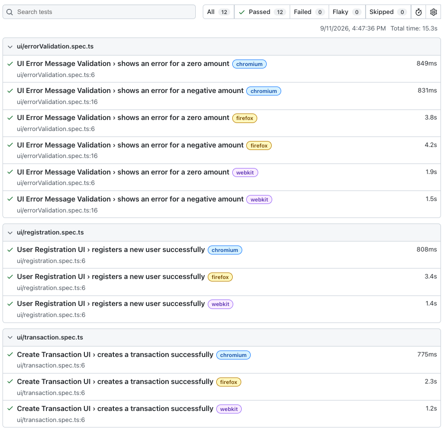

# Fintech Microservices QA Framework

[](https://github.com/sanzc3-source/fintech-microservices-qa-framework/actions/workflows/playwright.yml)

A test automation framework for a fintech microservices system, covering API and UI testing, authentication, test data management, reporting, and load testing. Built with Playwright and TypeScript.

The system under test models a payment platform with four services — a User service, a Transaction service, a Notification service, and an API gateway. A minimal Express backend implements these endpoints as a self-contained test fixture, so the tests exercise real HTTP behavior (status codes, validation, auth) rather than static mocks.

## What this covers

- **API tests** — CRUD, validation, error handling, and authentication/authorization for the User and Transaction services
- **UI tests** — registration, transaction creation, and error-message validation, run across Chromium, Firefox, and WebKit
- **Authentication** — API-key middleware with distinct 401 (missing key) and 403 (invalid key) handling
- **Test data management** — factories for generating valid and intentionally invalid test data
- **Reporting** — HTML, JSON, and JUnit test reports; automatic screenshots on UI failure; per-request API response logging
- **Load testing** — a k6 script measuring throughput and latency against the transaction endpoint

## Architecture

```
                    +-----------------+
                    |   API Gateway   |
                    |  (Express app)  |
                    +--------+--------+
                             |
          +------------------+------------------+
          |                  |                  |
   +------v------+   +-------v-------+   +------v-------+
   |    User     |   |  Transaction  |   | Notification |
   |   service   |   |    service    |   |   service    |
   +-------------+   +-------+-------+   +------^-------+
                             |                  |
                             +------------------+
                          triggers notification
                          on transaction created
```

Service boundaries are reflected in the code structure (separate route modules and API clients) rather than in separate deployed processes. The Notification service is triggered as a side-effect of transaction creation, modeling an event-driven interaction. Data is held in memory — see [Design notes](#design-notes).

## Project structure

```
.
|-- mock-server/          Express test fixture (the system under test)
|   |-- server.ts         Gateway entry point
|   |-- users.routes.ts
|   |-- transactions.routes.ts
|   |-- notifications.routes.ts
|   |-- auth.middleware.ts
|   |-- index.html        Minimal frontend for UI tests
|   +-- app.js
|-- src/
|   |-- api/              API client classes (UserClient, TransactionClient)
|   |-- pages/            Page Objects (RegistrationPage, TransactionPage)
|   |-- factories/        Test data factories
|   |-- utils/            Custom assertions, helpers, API logger
|   +-- config/           Environment configuration loader
|-- tests/
|   |-- api/              API test specs
|   +-- ui/               UI test specs
|-- performance/          k6 load test
+-- playwright.config.ts
```

## Prerequisites

- Node.js 18 or later
- npm
- [k6](https://k6.io/docs/get-started/installation/) (only required for the load test)

## Setup

```
git clone https://github.com/sanzc3-source/fintech-microservices-qa-framework.git
cd fintech-microservices-qa-framework
npm install
npx playwright install
cp .env.example .env
```

The `.env` file holds environment configuration (base URL, port, API key). Defaults work out of the box for local runs.

## Running the tests

The Playwright config starts the mock server automatically before tests run and shuts it down afterward, so no separate server startup is needed for the API and UI suites.

### All tests

```
npx playwright test
```

### API tests only

API tests run once (they have no browser dependency):

```
npx playwright test --project=api
```

```
Running 11 tests using 4 workers
  11 passed (3.1s)
```

### UI tests only

UI tests run across all three browsers:

```
npx playwright test --project=chromium --project=firefox --project=webkit
```

```
Running 12 tests using 4 workers
  12 passed (15.3s)
```

### HTML report

```
npx playwright show-report
```



## Load testing

The k6 script requires the mock server to be running. In one terminal:

```
npx tsx mock-server/server.ts
```

In another:

```
k6 run performance/transactions-load-test.js
```

```
  TOTAL RESULTS

    checks_total.......: 300     19.88/s
    checks_succeeded...: 100.00% 300 out of 300
    checks_failed......: 0.00%   0 out of 300

    status is 201
    response time < 200ms

    http_req_duration..: avg=4.57ms  med=2.75ms  p(95)=28.1ms  max=36.95ms
    http_req_failed....: 0.00%   0 out of 150
    http_reqs..........: 150     9.94/s
```

Ten virtual users over fifteen seconds, validating both correctness and a response-time threshold on every request. See [PERFORMANCE_NOTES.md](PERFORMANCE_NOTES.md) for scope and next steps.

## Environment configuration

Configuration is loaded from `.env` via a single config module (`src/config/env.ts`), so the base URL, port, and API key are defined in one place and shared by both the mock server and the tests.

| Variable | Default | Purpose |
|----------|---------|---------|
| `PORT` | `4000` | Port the mock server listens on |
| `BASE_URL` | `http://localhost:4000` | Base URL the tests target |
| `NODE_ENV` | `development` | Environment name |
| `API_KEY` | `test-api-key-12345` | Key required by protected endpoints |

`.env` is gitignored; `.env.example` is committed as a template. No real secrets are stored in the repository.

## Reporting

Each test run produces three report formats plus supporting artifacts:

- **HTML** — visual report at `playwright-report/`
- **JSON** — `test-results/results.json` for programmatic parsing
- **JUnit XML** — `test-results/results.xml`, consumable by CI systems
- **Screenshots** — captured automatically for any UI test failure
- **API response log** — `test-results/api-responses.log`, one JSON line per logged request

## Design notes

The mock server uses an in-memory data store rather than MongoDB or Redis. The tests target HTTP behavior and business rules, not database performance, and the API clients talk to endpoints rather than to the database directly — so the storage layer could be swapped for a real database without changing any test.

Authentication uses a simple API-key scheme. Registration is intentionally left public, since requiring credentials to create an account is a contradiction; all other read and write endpoints are protected.

## Continuous integration

Every push runs the full Playwright suite on GitHub Actions (see the badge above). The workflow uses Playwright's `webServer` configuration to start the mock server in CI, so the same tests that pass locally pass in the pipeline.
